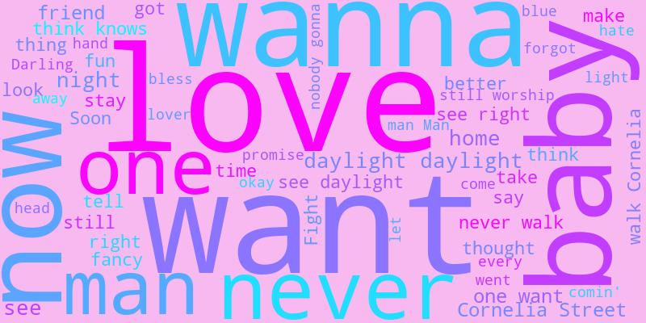

# Taylor Swift wordcloud

I created wordclouds from Taylor's song lyrics.

I wanted to visualise the tendency and frequency of words that appear in her songs for each album. As it's well-known, each of her albums is very distinctive to each other with regard to the concept, music genre, and background of the stories told in lyrics. They represent the **Eras** in her music career and her own experience at the time in life.

I am a fan of Taylor, I love her music, and I got an idea that it would be interesting to create wordcrouds for each of her albums from the lyrics, and hopefully I can see some similarities and differences betweem them in terms of word choices and frequencies.

In short, I just wanted to create some awesome visualisation that represents her masterpieces!

## Challenges

I had two challenges in this project:

1. `get_spotify_data.ipynb`

    Get Taylor's all albums and lyrics data from [Spotify Web API](https://developer.spotify.com/documentation/web-api) and [Genius API](https://docs.genius.com/) through their APIs.

    NOTE: Some Client IDs and Access token have been stored in my local `config.py`, which is not in this repository. If you would like to run this notebook, please create your own *config.py*!

2. `create_wordclouds.ipynb`

    Retrieve the lyrics of all songs in an album with removing unnecessary characters at the start and the end of the lyrics. Concatenate all the album lyrics into one text string, and pass it to the [Python wordcloud generator](https://pypi.org/project/wordcloud/#description).

## Results

Here are the results! I placed in decending order of time in which the songs were written and the album was originally published. (However, I chose *Taylor's version* for those that have them to acquire lyrics including *from the Vault*, assuming they were also written when the album was created originally)

.jpg)
.jpg)
.jpg)

.jpg)
.jpg)
.jpg)
.jpg)

People say Taylor just sings about **love** with her (ex) boyfriend, but when it comes to the word frequency, it is not always the case in some albums.

